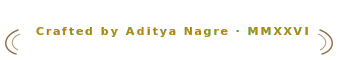

 

&nbsp;

&nbsp;

&nbsp;

  

<!-- Ceremonial index — click a pillar to be carried there -->
<table>
<tr>
<td align="center">📜&nbsp;<a href="#-the-oracle">The Oracle</a></td>
<td align="center">🏛️&nbsp;<a href="#️-the-forum">The Forum</a></td>
<td align="center">⚔️&nbsp;<a href="#️-the-arsenal">The Arsenal</a></td>
<td align="center">📖&nbsp;<a href="#-the-chronicles">The Chronicles</a></td>
<td align="center">🐍&nbsp;<a href="#-the-ouroboros">The Ouroboros</a></td>
<td align="center">🏺&nbsp;<a href="#-the-agora">The Agora</a></td>
</tr>
</table>

## 📜 The Oracle

<i>Unroll the scroll to hear what is written.</i>

  

## 🏛️ The Forum

<table width="100%" border="0" cellspacing="0" cellpadding="0">
  <tr>
    <td width="50%" valign="top" align="center">
      
    </td>
    <td width="50%" valign="top" align="center">
      
    </td>
  </tr>
</table>

<b>🏺 Unseal the Reliquary — Quick Facts</b>

 

| | |
|---|---|
| 🧠 **Focus** | Building clean, fast, and enduring web experiences |
| 🌱 **Currently studying** | Deeper React patterns & scalable backend design |
| ⚡ **Decree** | This README is a temple built entirely of Markdown and SVG |
| 📍 **Domain** | India |
| 💬 **Seek counsel on** | React, Node.js, Firebase — or a good cup of coffee ☕ |

## ⚔️ The Arsenal

  

<i>The tools with which the monuments are raised.</i>

## 📖 The Chronicles

<table width="100%" border="0" cellspacing="0" cellpadding="0">
  <tr>
    <td width="50%" valign="top" align="center">
      
    </td>
    <td width="50%" valign="top" align="center">
      
    </td>
  </tr>
</table>

  

  

## 🐍 The Ouroboros

<i>The serpent that devours its own tail — an ancient sign of the endless cycle. Here, it devours a year of commits instead.</i>

  

⚙️ Summoned daily by <code>.github/workflows/snake.yml</code> via GitHub Actions.

## 🏺 The Agora

  <i>The public square — where one goes to find and be found.</i>

  <table align="center" style="background: rgba(27, 23, 18, 0.7); border: 1px solid #8C6A3F; border-radius: 14px; padding: 10px 20px; box-shadow: 0 10px 30px rgba(0,0,0,0.6);">
    <tr>
      <td align="center" style="padding: 0 10px;">
        
      </td>
      <td align="center" style="padding: 0 10px;">
        
      </td>
      <td align="center" style="padding: 0 10px;">
        
      </td>
      <td align="center" style="padding: 0 10px;">
        
      </td>
    </tr>
  </table>

  

