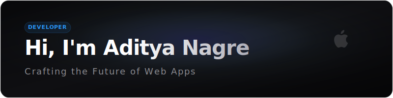
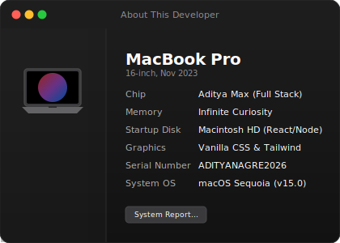

# 

  
  &nbsp;
  

---

## 💻 System Status

<table width="100%" border="0" cellspacing="0" cellpadding="0">
  <tr>
    <td width="50%" valign="top" align="center">
      
    </td>
    <td width="50%" valign="top" align="center">
      
    </td>
  </tr>
</table>

---

## 📊 Analytics & Performance

<table width="100%" border="0" cellspacing="0" cellpadding="0">
  <tr>
    <td width="50%" valign="top" align="center">
      
    </td>
    <td width="50%" valign="top" align="center">
      
    </td>
  </tr>
</table>

---

## 📱 Launchpad (Connect & Socials)

  Click an application below to open.

  <!-- macOS Dock Wrapper -->
  <table align="center" style="background: rgba(30, 30, 30, 0.6); border: 1px solid rgba(255,255,255,0.08); border-radius: 20px; padding: 10px 20px; box-shadow: 0 10px 30px rgba(0,0,0,0.5);">
    <tr>
      <!-- LinkedIn App Icon -->
      <td align="center" style="padding: 0 10px;">
        
      </td>
      <!-- CodeSandbox App Icon -->
      <td align="center" style="padding: 0 10px;">
        
      </td>
      <!-- Instagram App Icon -->
      <td align="center" style="padding: 0 10px;">
        
      </td>
    </tr>
  </table>

  

