 

&nbsp;

&nbsp;

&nbsp;

  

<!-- Finder-style quick nav — click to jump around the "desktop" -->
<table>
<tr>
<td align="center"><a href="#-terminal">⌨️&nbsp;Terminal</a></td>
<td align="center"><a href="#-system-status">💻&nbsp;System</a></td>
<td align="center"><a href="#️-tech-stack">🛠️&nbsp;Stack</a></td>
<td align="center"><a href="#-analytics--performance">📊&nbsp;Stats</a></td>
<td align="center"><a href="#-contribution-snake">🐍&nbsp;Snake</a></td>
<td align="center"><a href="#-launchpad-connect--socials">📱&nbsp;Connect</a></td>
</tr>
</table>

---

## ⌨️ Terminal

Booting developer profile...

  

---

## 💻 System Status

<table width="100%" border="0" cellspacing="0" cellpadding="0">
  <tr>
    <td width="50%" valign="top" align="center">
      
    </td>
    <td width="50%" valign="top" align="center">
      
    </td>
  </tr>
</table>

<b>🗂️ Click to expand — Quick Facts (Finder &gt; Get Info)</b>

 

| | |
|---|---|
| 🧠 **Focus** | Building clean, fast, and delightful web experiences |
| 🌱 **Currently exploring** | Deeper React patterns & scalable backend design |
| ⚡ **Fun fact** | This entire README is basically a fake macOS running on Markdown |
| 📍 **Based in** | India |
| 💬 **Ask me about** | React, Node.js, Firebase, or good coffee ☕ |

---

## 🛠️ Tech Stack

  

Hover-friendly on GitHub's web view — click any icon to learn more about it.

---

## 📊 Analytics & Performance

<table width="100%" border="0" cellspacing="0" cellpadding="0">
  <tr>
    <td width="50%" valign="top" align="center">
      
    </td>
    <td width="50%" valign="top" align="center">
      
    </td>
  </tr>
</table>

  

  

---

## 🐍 Contribution Snake

A snake that literally eats my GitHub contribution graph. Yes, it's real.

  <picture>
    <source media="(prefers-color-scheme: dark)" srcset="https://raw.githubusercontent.com/adityanagre/AdityaNagre/output/github-contribution-grid-snake-dark.svg" />
    <source media="(prefers-color-scheme: light)" srcset="https://raw.githubusercontent.com/adityanagre/AdityaNagre/output/github-contribution-grid-snake.svg" />
    
  </picture>

⚙️ Powered by <code>.github/workflows/snake.yml</code> — runs automatically every day via GitHub Actions.

---

## 📱 Launchpad (Connect & Socials)

  Click an application below to open.

  <!-- macOS Dock Wrapper -->
  <table align="center" style="background: rgba(30, 30, 30, 0.6); border: 1px solid rgba(255,255,255,0.08); border-radius: 20px; padding: 10px 20px; box-shadow: 0 10px 30px rgba(0,0,0,0.5);">
    <tr>
      <!-- GitHub App Icon -->
      <td align="center" style="padding: 0 10px;">
        
      </td>
      <!-- LinkedIn App Icon -->
      <td align="center" style="padding: 0 10px;">
        
      </td>
      <!-- CodeSandbox App Icon -->
      <td align="center" style="padding: 0 10px;">
        
      </td>
      <!-- Instagram App Icon -->
      <td align="center" style="padding: 0 10px;">
        
      </td>
    </tr>
  </table>

  

